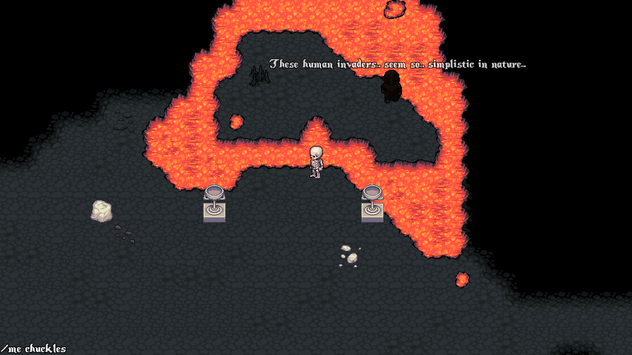
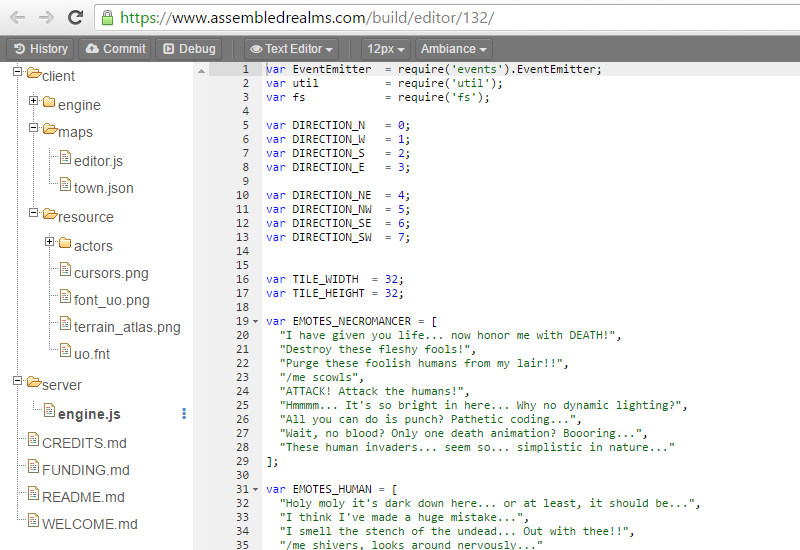

When I was eleven years old I had an experience that would eventually set the course for my entire professional life. It was my first day of class in the 6th grade. The middle school was experimenting with a new curriculum that would expose gifted students to a computer in every classroom, the lion-share of which being the venerable Macintosh Classic II. 

I immediately began tinkering. Lessons were completed as quickly as possible to afford me more time on the machines. I stayed after school learning AppleScript. I'd create simple slide-based adventure games for my friends to play and solve (think Myst written by a little kid with no graphics at all). I wanted to create more advanced games so I checked out a book from the library that would teach me how to write BASIC. The book had full source code examples that I hungrily reverse engineered and re-imagined. 

This early passion to figure out how things work and to make things my friends could enjoy ignited a life long career in software development. Assembled Realms hopes to offer that same sense of wonder and opportunity with a significantly lower barrier to entry. The idea is to provide structured game "engines", essentially mini working games, to users that serve as the foundation for experimentation, that can be picked apart or completely demolished and rebuilt. 

All client and server code is written in Javascript and can be created/edited directly from a browser. No software to download, no platform restrictions. Realm builders can launch their games with a click of a button, receiving a public URL to give to friends. Bugs and improvements can be suggested by the user base, pushing the realm builder to research, explore and learn. Users are introduced to concepts essential to the software development lifecycle - committing, publishing, debugging, etc - in a fun and effective way.

I'm excited to see what the community can produce and am making myself available to help in any way I can. 

[Assembled Realms](https://www.assembledrealms.com)

[@chasebgale](https://twitter.com/chasebgale)