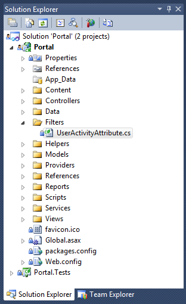

When designing enterprise applications I often run into the same request from the business: ‘user tracking.’ Who created this entity? What time? Why was this entity created (origin tracking)? In the past I have seen colleagues create additional columns, such as userId and creationTime, on every ‘trackable’ table in the system. At the time, this made sense; However, with the advent of Global Filters in MVC3, more efficient ways of doing this have become apparent. Let’s jump in head first.

Open up Visual Studio 2010 and your MVC3 project. If you’d like, simply create a new MVC3 Web Application for the purposes of this tutorial. Next, create a folder under the project root named ‘Filters.’ In this folder, create a class named ‘UserActivityAttribute.cs’ – please note, these names can be anything you desire and hold no special meaning. When you’re finished, your solution explorer should look something like the following:



Still with me? Awesome. Open up your newly created class and inherit from ‘ActionFilterAttribute.’ ActionFilterAttribute has several methods you can override which you can read about individually [over at MSDN](http://msdn.microsoft.com/en-us/library/system.web.mvc.actionfilterattribute.aspx); For now though, let’s focus on ‘OnResultExecuting.’ As you might have guessed, this method is fired before the result is executed. Go ahead and override this method, bringing your class to look something like this:

``` csharp
public class UserActivityAttribute : ActionFilterAttribute
{
    public override void OnResultExecuting(ResultExecutingContext filterContext)
    {
        base.OnResultExecuting(filterContext);
    }
}
```

Now for the fun stuff! As I’m sure you’ve observed, we get one argument from this method: ‘filterContext.’ From this ResultExecutingContext we will corral all the information we need to track our user’s actions. Which ActionFilterAttribute method to override depends on what type of information you are trying to capture and the same goes for the approach. To that end, let’s say that in your scenario entities are created using the standard ‘Create’ action. Furthermore, assume that after successful creation you redirect to that entities ‘Details’ action.

So, with these assumptions fresh in our minds, what is the first step to isolate the data we want?

``` csharp
public class UserActivityAttribute : ActionFilterAttribute
{
    public override void OnResultExecuting(ResultExecutingContext filterContext)
    {
        if ((filterContext.Result is RedirectToRouteResult) && 
            (filterContext.RequestContext.HttpContext.Request.RequestType == "POST"))
        {
 
        }
        base.OnResultExecuting(filterContext);
    }
}
```

As you can see, we check that the result primed for execution is of the type ‘RedirectToRouteResult.’ Additionally, we ensure the request was a POST, the default request type for ‘Create’ methods. Now that we have this in place, let’s extract some information about the RouteData of the **Request** and filter down further.

``` csharp
public class UserActivityAttribute : ActionFilterAttribute
{
    public override void OnResultExecuting(ResultExecutingContext filterContext)
    {
        if ((filterContext.Result is RedirectToRouteResult) &&
            (filterContext.RequestContext.HttpContext.Request.RequestType == "POST"))
        {
            var originController = filterContext.RouteData.Values["controller"].ToString();
            var originAction = filterContext.RouteData.Values["action"].ToString();
 
            if (originAction == "Create")
            {
 
            }
        }
        base.OnResultExecuting(filterContext);
    }
}
```

Now we have the controller and action of the request, using this information we filter out actions not matching our mock scenario, create calls. The final step is to decide what information to store and to format it accordingly. Let’s assume this application tracks brick-and-mortar stores and the customers that frequent them. We have two different controllers, Customer and Store, and based on what we are creating we want to change the formatting. I’ll let the code do the talking:

``` csharp
public class UserActivityAttribute : ActionFilterAttribute
{
  public override void OnResultExecuting(ResultExecutingContext filterContext)
  {
    if ((filterContext.Result is RedirectToRouteResult) &&
        (filterContext.RequestContext.HttpContext.Request.RequestType == "POST"))
    {
      var originController = filterContext.RouteData.Values["controller"].ToString();
      var originAction = filterContext.RouteData.Values["action"].ToString();
 
      if (originAction == "Create")
      {
        RedirectToRouteResult redirectResult = filterContext.Result as RedirectToRouteResult;
        var form = filterContext.RequestContext.HttpContext.Request.Form;
 
        var destinationController = redirectResult.RouteValues["controller"];
        var destinationAction = redirectResult.RouteValues["action"];
        var destinationId = redirectResult.RouteValues["id"];
 
        var destination = "/" + destinationController + "/" + destinationAction + "/" + destinationId;
        var title = "";
 
        switch (destinationController)
        {
          case "Customer":
            title = form["FirstName"] + " " + form["LastName"];
            break;
          case "Store":
            title = "#" + destinationId.ToString();
            break;
        }
 
        var action = "Created " + destinationController + " [" + title + "](" + destination + ")";
        Tracking.RecordSystemUserAction(action);
      }
    }
  }
}
```

Too cool, right? I love this stuff. Let’s break it down; First off, we pull out and cast the Result object. Secondly, because we know we are in a post, we pull out the form the user submitted. Thirdly, we extract all of the destination route information and use it to switch and further format. Finally, we bundle all of this up into a nice, human readable string and send it off to our utility method to be saved.

How you format this information is entirely up to you and your use case. As you may have figured out from the psuedo-markup I am generating, in my case I take anything inside the brackets and generate a url from the destination. When history is presented the end user, they see a friendly ‘wall post’ style list, allowing them to easily click through their history.

Ok, so I said that was the last step, I fibbed. Now we have this badass user tracking ActionFilterAttribute, how do we tell MVC3 to execute this code on every request? Under the project root in your Solution Explorer, find and open a file named ‘Global.asax.’ You’ll see a method titled ‘RegisterRoutes.’ Paste the following code above it.

``` csharp
public static void RegisterGlobalFilters(GlobalFilterCollection filters)
{
  filters.Add(new UserActivityAttribute());
}
```

Now find the ‘Application_Start()’ method in the same file. Ensure that ‘RegisterGlobalFilters(GlobalFilters.Filters);’ is called within. That’s it. For real this time. When your MVC3 application starts, it will call this method; Behind the scenes, every action method is adorned with the attribute we just created.

The possibilities exposed by Global Filters, coupled with their ease of implementation, makes them an essential card up your sleeve. I’ll leave you with one friendly piece of advice: Remember that these overridden methods will be called with *every single request*. Make your initial condition as exclusive as possible to save cpu cycles.

Best of luck.