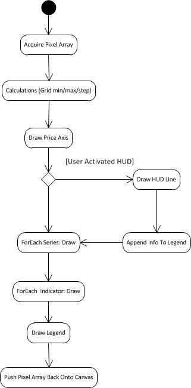

Utilizing HTML5′s canvas, I present to you my newest open-source project: [rocketcharts](https://github.com/chasebgale/rocketcharts). I am following the "release early, release often" mantra for this project, so I’d keep it out of production code for the moment. Speaking of code, how did I generate the above interactive chart?

```html
<script type="text/javascript" src="rocketcharts.js"></script>
<script type="text/javascript" src="jquery-1.5.1.min.js"></script>
<script type="text/javascript">
   $(document).ready(function () {    
 
      var style = new Object();
      style.UpColor = {r: 0, g: 255, b: 0};
      style.DownColor = {r: 255, g: 0, b: 0};
 
      var settings = new Object();
      settings.customUI = true;
      
      var rocketcharts = new Rocketchart();
 
      rocketcharts.init(document.getElementById("rocketchart"), settings); 
 
      var googData = [{date: "11/9/2010", open: 17.22, high: 17.6, low: 16.86, close: 16.97, volume: 56218900},
                      {date: "11/10/2010", open: 17, high: 17.01, low: 16.75, close: 16.94, volume: 17012600},
                      ...
                      {date: "9/29/2011", open: 14.34, high: 14.39, low: 13.15, close: 13.42, volume: 45776600},
                      {date: "9/30/2011", open: 13.21, high: 13.44, low: 13.11, close: 13.17, volume: 30232800}];
 
      // rocketcharts.addSeries(title, data, type, style, panel);
      rocketcharts.addSeries("GOOG", googData, undefined, style);
      // rocketcharts.addIndicator(id, params, series, panel);
      rocketcharts.addIndicator("movingaverageconvergancedivergance", undefined, 0);
 
   });
</script>
```

## A View of the Architecture from 30,000 Feet

Before we jump right into how to use rocketcharts, let’s first understand what is going on behind the scenes. If you look at the code above, you’ll notice the first method call: `rocketcharts.init(element, settings);` "element" points to a container in your DOM, typically a DIV, where you want the chart displayed. Rocketcharts respects any styles you have set for this element and will not resize it; Instead, JQuery is employed to append a canvas, referred to as a chart panel, to that DIV.

"But what is a panel?" If you look again at the code block above, you’ll notice I don’t specify the last parameter of the "addIndicator" call which specifies a panel ID. The lack of a panel being passed creates a new panel for the indicator to be drawn on, i.e. a new canvas appended to the DOM. Adding a new element for each panel, rather than drawing all the panels on one large element, brings several advantages to the table. For one, we can leverage the existing power of a modern browser using JQueryUI to allow effortless user-resizing of the panels. No need to worry about vertical scrolling either, as this is taken care of for us.

Once we have our panels appended to the DOM, the real fun can begin: pixel manipulation. *"Am I nerd, a geek or just a passionate developer? Playing with pixels is fun, dammit!"* Essentially, rocketcharts performs some initial calculations, then loops through each panel and calls it’s draw method.



## The State of Rocketcharts

For the moment, rocketcharts is functionally quite basic. You can add your own Open-High-Low-Close-Date data to the chart. You can add one of three indicators and specify to draw over the primary series or on a new panel. Simple for now but the foundation is in place – adding additional studies/indicators is a simple affair.

Within the immediate future I plan to add zooming and horizontal scrolling, more indicators and a more robust UI allowing the user, rather than you, to manage the chart. I encourage you to [follow along with the source](https://github.com/chasebgale/rocketcharts), all feedback is welcome and will help keep the momentum of the project high.